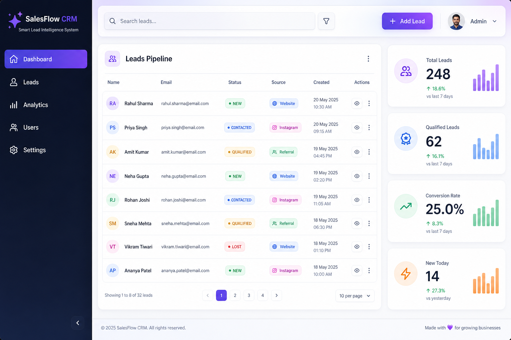
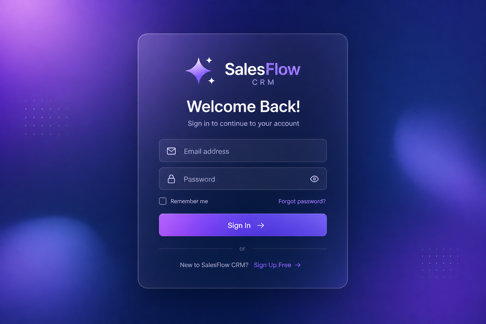
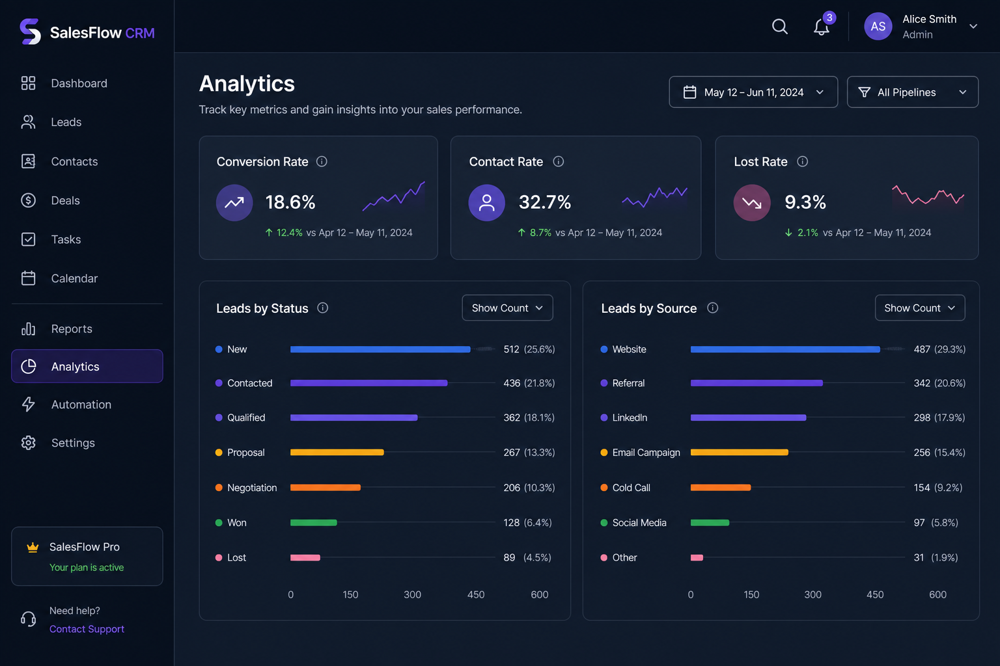

# SalesFlow CRM

**Smart Lead Intelligence Dashboard** — a full-stack mini CRM for sales teams to track leads from Website, Instagram, and Referrals.

<p align="center">


</p>

<p align="center">
  <a href="#-demo-video">Demo Video</a> •
  <a href="#-screenshots">Screenshots</a> •
  <a href="#-quick-start">Quick Start</a> •
  <a href="docs/GUIDE.md">Full Docs</a> •
  <a href="docs/DEMO_SCRIPT.md">Record Demo</a>
</p>

---

## Demo Video

> **Record your walkthrough** using [docs/DEMO_SCRIPT.md](docs/DEMO_SCRIPT.md), then add it below.

### Option 1 — YouTube (best for GitHub README)

1. Upload your demo to YouTube  
2. Replace `YOUR_VIDEO_ID` with the ID from `youtube.com/watch?v=YOUR_VIDEO_ID`

<!-- [](https://www.youtube.com/watch?v=YOUR_VIDEO_ID) -->

**Placeholder** — add your link here:

```
https://www.youtube.com/watch?v=YOUR_VIDEO_ID
```

### Option 2 — Local MP4 (in repo)

1. Record and save as [`assets/demo.mp4`](assets/demo.mp4)  
2. Uncomment this block in README:

<!--
https://github.com/YOUR_USERNAME/gigflow/assets/demo.mp4
-->

Or embed in browser:

```html
<video src="assets/demo.mp4" controls width="100%"></video>
```

### Option 3 — Loom / Drive

Paste your share link: `_Add Loom or Google Drive link here_`

---

## Screenshots

<table>
  <tr>
    <td align="center"><b>Dashboard & Leads</b></td>
    <td align="center"><b>Login</b></td>
    <td align="center"><b>Analytics</b></td>
  </tr>
  <tr>
    <td></td>
    <td></td>
    <td></td>
  </tr>
</table>

> Tip: Replace mockups with real screenshots from your running app — see [assets/README.md](assets/README.md).

---

## Quick Start

```bash
# 1. Install
cd backend  && npm install && cp .env.example .env
cd ../frontend && npm install && cp .env.example .env

# 2. Run API (terminal 1)
cd backend && npm run dev

# 3. Run UI (terminal 2)
cd frontend && npm run dev
```

Open **http://localhost:5173** → Sign up → start managing leads.

| Service  | URL |
|----------|-----|
| Frontend | http://localhost:5173 |
| API      | http://localhost:5000/api |
| Health   | http://localhost:5000/health |

---

## What It Does

| Feature | Details |
|---------|---------|
| **Auth** | Register, login, JWT, bcrypt |
| **RBAC** | Admin (full access) vs Sales (no delete) |
| **Leads** | CRUD, status badges, sources |
| **Search** | Debounced (300ms) name + email |
| **Filters** | Status + source + sort combined |
| **Pagination** | Server-side, 10 per page |
| **Analytics** | Live stats & charts |
| **Export** | CSV with active filters |
| **UI** | Dark mode, responsive, 5 pages |

---

## Tech Stack

`React 19` · `TypeScript` · `Vite` · `Tailwind` · `Express` · `Mongoose` · `MongoDB` · `Axios` · `JWT`

---

## Project Layout

```
gigflow/
├── assets/          # Screenshots + demo.mp4 (you add video)
├── docs/
│   ├── GUIDE.md     # Full API, schema, troubleshooting
│   └── DEMO_SCRIPT.md
├── backend/         # Express API
└── frontend/        # React app
```

---

## Environment

**backend/.env**

```env
PORT=5000
MONGODB_URI=mongodb://127.0.0.1:27017/smart-leads
JWT_SECRET=change_me
JWT_EXPIRES_IN=7d
```

**frontend/.env**

```env
VITE_API_URL=http://localhost:5000/api
```

---

## API (summary)

| Method | Endpoint | Auth |
|--------|----------|------|
| POST | `/api/auth/register` | — |
| POST | `/api/auth/login` | — |
| GET | `/api/leads` | JWT |
| POST | `/api/leads` | JWT |
| PUT | `/api/leads/:id` | JWT |
| DELETE | `/api/leads/:id` | Admin |
| GET | `/api/leads/export/csv` | JWT |

Full reference → **[docs/GUIDE.md](docs/GUIDE.md)**

---

## Troubleshooting

| Problem | Fix |
|---------|-----|
| Port 5000 in use | `taskkill /PID <id> /F` |
| MongoDB SRV error on Windows | Use standard URI, not `mongodb+srv` |
| `@` in Atlas password | Encode as `%40` |

Details → **[docs/GUIDE.md#troubleshooting](docs/GUIDE.md#troubleshooting)**

---

## Documentation

| Doc | Description |
|-----|-------------|
| [docs/GUIDE.md](docs/GUIDE.md) | Complete technical documentation |
| [docs/DEMO_SCRIPT.md](docs/DEMO_SCRIPT.md) | 90-second demo video script |
| [assets/README.md](assets/README.md) | Screenshots & video file guide |

---

## License

Educational / portfolio use.

---

<p align="center"><b>SalesFlow CRM</b> — Smart Lead Intelligence System</p>
# GigFlow
